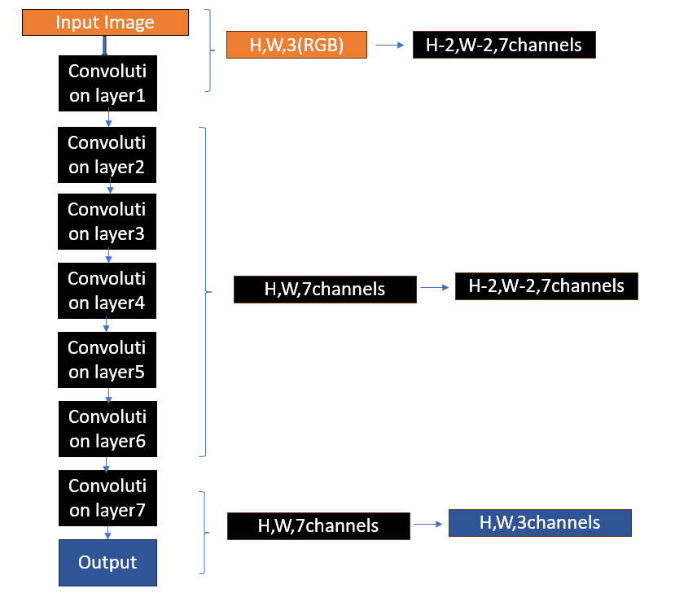
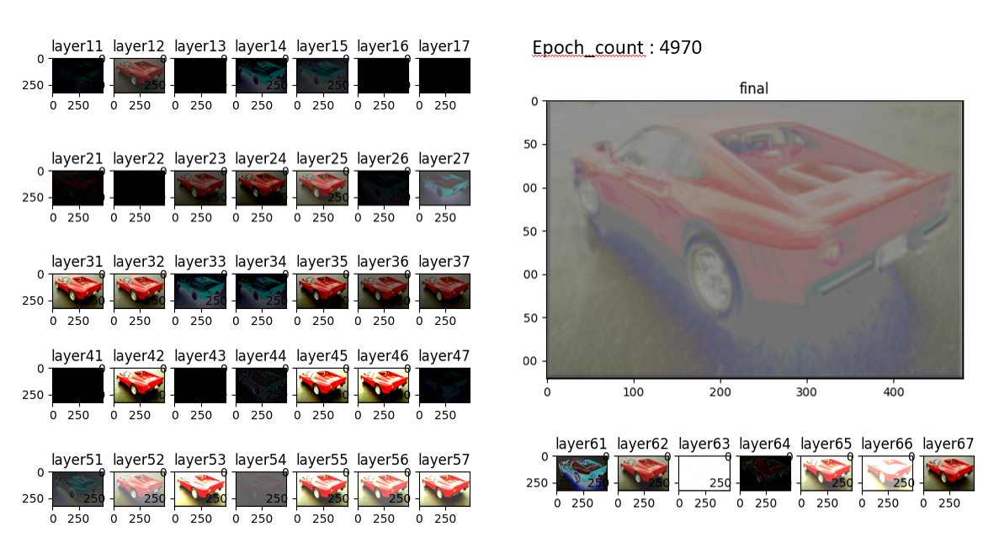
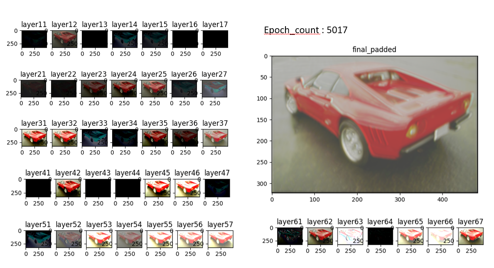

# CNN From Scratch Using NumPy: Manual Forward and Backpropagation
### Overview

This project implements a complete Convolutional Neural Network (CNN) from scratch using only NumPy, without relying on deep learning frameworks such as TensorFlow or PyTorch.

The goal of this project was to gain a deep understanding of how convolutional neural networks operate internally by manually implementing forward propagation, backpropagation, weight updates, gradient computation, and image reconstruction tasks.

## Features

- 7-layers CNN architecture
- Manual convolution implementation
- Full convolution for backpropagation
- Correlation-based weight gradient computation
- He weight initialization
- Custom activation functions
- Binary classification output layer using Sigmoid
- Gradient clipping
- Checkpoint saving and loading
- Image reconstruction experiments

## Architecture

## Feature Maps

## Implemented Components
### Forward Propagation
Implemented manually:

- Convolution
- Padding
- Bias addition
- Activation functions

### Backpropagation

Implemented manually:

- dL/dW
- dL/dA
- dL/dZ
- Full convolution
- Correlation-based kernel gradients

### Training Utilities
- Checkpointing
- Gradient clipping
- Custom learning rate control
- Weight initialization

## Training Results 
The model was trained to learn horizontal flipping of Image with dimensions 481 * 321 . As this model was purely built with numpy it processes the computations on CPU . Due to use of more loops and CPU limitations the training was slow for this model.  
Initially model was trained normally but due to slow nature , decided to start training the model from a stablized checkpoint . This checkpoint came from similar network structure built with Pytorch .
Below images cover the original image  and generated image after training with this model to a particular epoch.  

If you look and compare the both Images you can observe the final Image showing the movement nature.It looks network is trying to move the pixels . As this model was 7 layered only , the receptive field of this model is small so the information cant be carried upto last.
## Technical Challenges Solved

During development several deep learning challenges were encountered and investigated:

- Exploding gradients
- Vanishing gradients
- Activation saturation
- Numerical instability (NaN values)
- Gradient flow debugging
- Weight initialization effects
- Training stability

## Technologies Used
- Python
- NumPy
- OpenCV
- Matplotlib

## Educational Goal

This project was built primarily as a learning exercise to understand the mathematical and computational foundations of convolutional neural networks without relying on high-level deep learning libraries.
